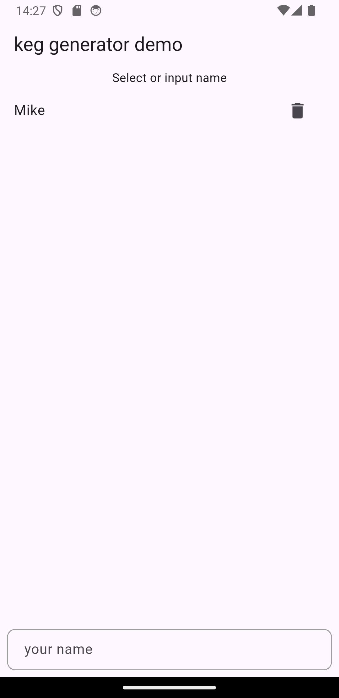
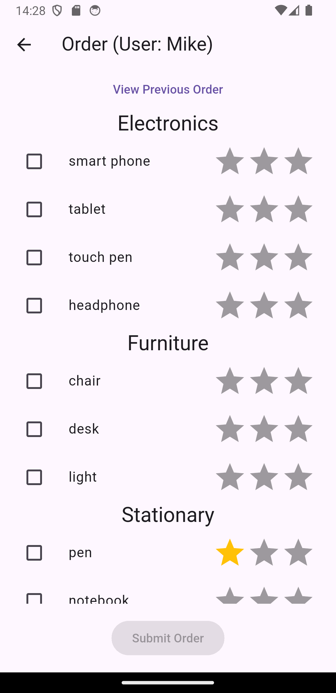
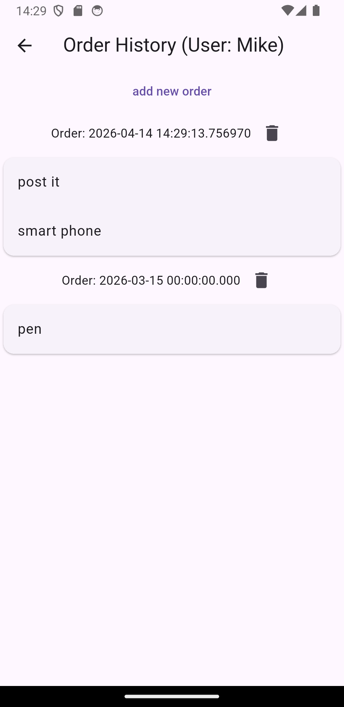
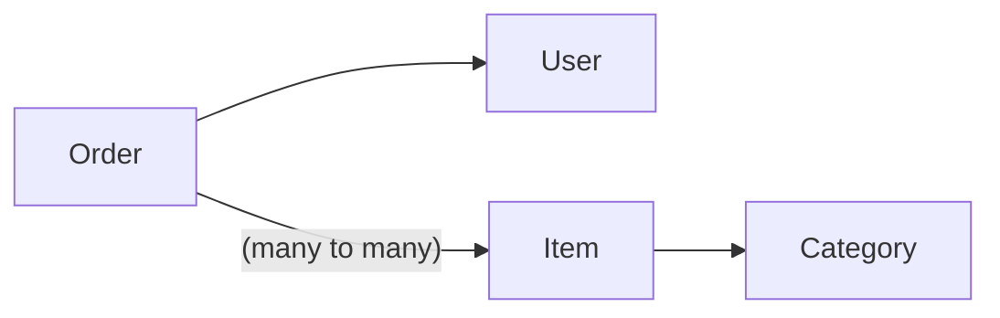

# keg_generator example

This is flutter example project using keg_generator,
which is simplified shopping app made of three screen.

|Home Screeen|Order Screen|Order History Screen|
|:--------:|:--------:|:--------:|
||||

On home screen, it is able to add, delete or select user.

On order screen, it is able to select several items, and submit new order.

Star rating is evaluated by number of orders of each item.

On order history screen, it is able to view and delete previous orders.

## Data Model

Following is table classes defined in this example.

Order and Item is many to many relationship.
An Order may have several items which ordered,
and item is refered by several orders.

Back links is also defined for all relationships,
so from User all Orders of the user can be referred,
and from Item number of Orders for each Item can be acquired.

These are defined in [lodaldb.dart](lib/localdb.dart) file.
